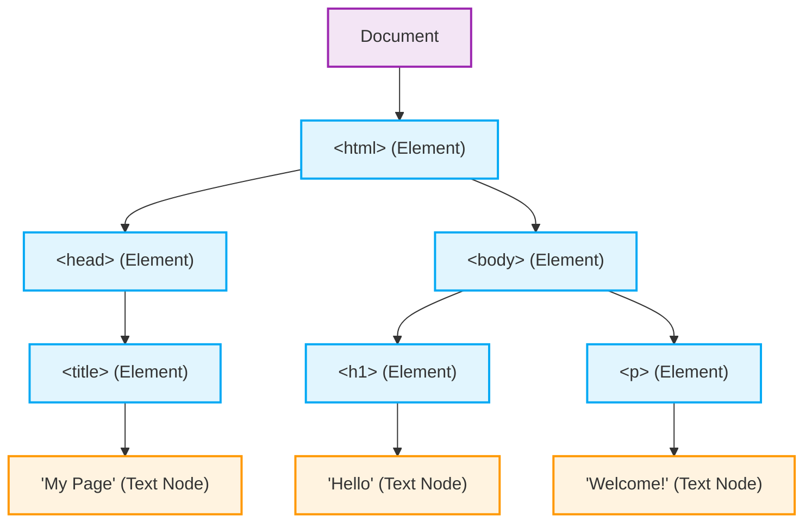

# DOM Tree Structure

When the browser parses an HTML document, it creates a tree-like structure of nodes.

Given the following simple HTML:
```html
<html>
  <head>
    <title>My Page</title>
  </head>
  <body>
    <h1>Hello</h1>
    <p>Welcome!</p>
  </body>
</html>
```

Here is how the browser represents it as a Document Object Model (DOM) Tree:

> **Note on Realism:** 
> This diagram is slightly simplified for clarity. In a real browser DOM, the whitespace (line breaks and indentation) between the HTML tags would also be represented as empty "Text Nodes". We have omitted them here to focus on the primary structure, but you will see them if you inspect `childNodes` in JavaScript!


