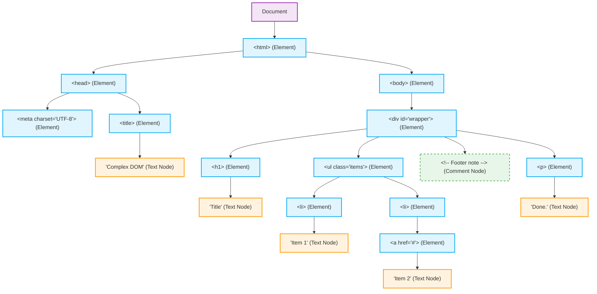

# Complex DOM Tree Structure

This diagram shows a more advanced HTML document. Notice how attributes (like `id` and `class`) are considered part of the Element nodes, while comments and text have their own distinct nodes in the tree.

Given the following HTML:
```html
<!DOCTYPE html>
<html>
  <head>
    <meta charset="UTF-8">
    <title>Complex DOM</title>
  </head>
  <body>
    <div id="wrapper" class="container">
      <h1>Title</h1>
      <ul class="items">
        <li>Item 1</li>
        <li><a href="#">Item 2</a></li>
      </ul>
      <!-- Footer note -->
      <p>Done.</p>
    </div>
  </body>
</html>
```

Here is how the browser represents it as a Document Object Model (DOM) Tree:

> **Note on Realism:** 
> Just like the previous diagram, this is simplified for clarity. In a real browser DOM, every line break and space for indentation between these elements (e.g., between `</head>` and `<body>`, or between the `<li>` tags) creates its own distinct "Text Node" containing whitespace. A perfectly realistic diagram would be cluttered with these whitespace text nodes, which is why they are omitted in this visualization.


