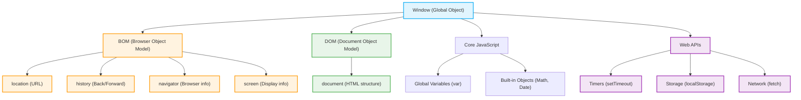

# The Window Object Hierarchy

In a browser environment, the highest level object is the `window`. It serves as the Global Object for JavaScript and represents the browser window (or tab) itself. Everything you do in the browser is contained within this object.

Here is a visual representation of how the `window` object organizes the different models and APIs:

## Key Concepts

1. **The BOM (Browser Object Model):** Controls the browser environment itself. It allows you to interact with the browser outside of the document. Examples include manipulating the URL (`location`), navigating the back button (`history`), or checking the screen size (`screen`).
2. **The DOM (Document Object Model):** Controls the HTML content inside the window. It represents the structure of your HTML document and lives inside the window under `window.document`.
3. **Core JavaScript:** These are the base language features and objects like `Math`, `Date`, `Array`, and any global variables you create (e.g., using `var`), which automatically become properties of the `window` object.
4. **Web APIs:** Additional tools provided by the browser that are not strictly part of the JavaScript language specification, such as timers (`setTimeout`), storage (`localStorage`), and network requests (`fetch`).
