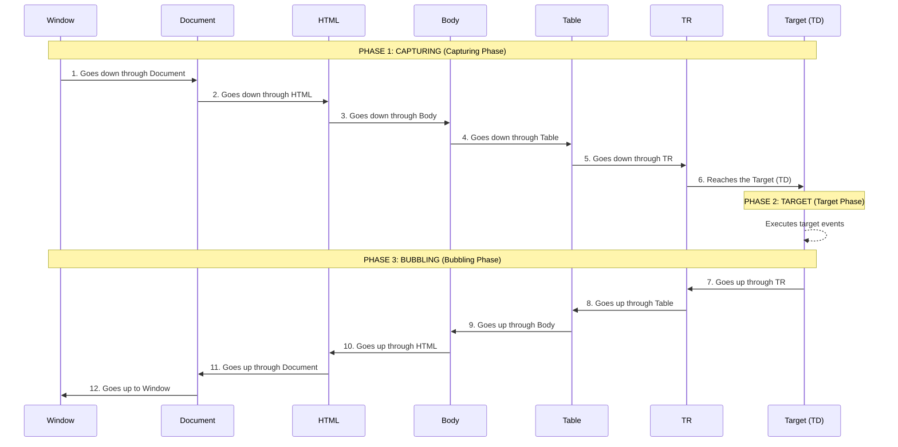

# 1. Introduction to Event Propagation

Event Propagation is the **most important** and profound concept to master DOM interaction.

When you click on an element (for example, a `<td>` inside a `<tr>` inside a `<table>`), the click doesn't just happen in isolation on the `<td>`.

Technically, your click pierces through multiple layers. You also clicked on the `<tr>`, the `<table>`, the `<body>`, the `<html>`, and the `window` object.

The DOM standard defines that the journey of an event always has **3 Phases**:

In the following lessons, we will analyze each of these phases.
