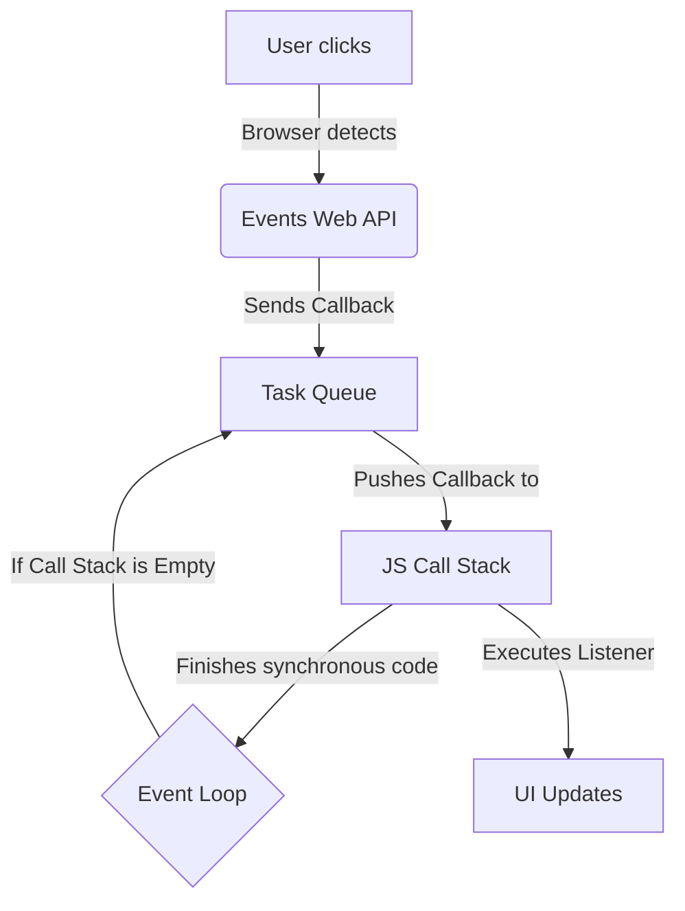

# 2. The Event Loop & Async Events

DOM Event Listeners are the purest example of **asynchronous programming** in JavaScript.

If JavaScript is single-threaded, how can it wait for a user to click a button without blocking the main thread? By offloading the waiting to the browser.

### How it works under the hood:

1. **Web APIs:** When we do `addEventListener('click', callback)`, JS doesn't sit around waiting. It passes the responsibility to the browser's Web APIs (written in C++). The Web API watches for the click in the background.
2. **Task Queue:** When the user finally clicks, the browser doesn't interrupt JS immediately. It takes your `callback` function and pushes it into the **Task Queue** (a waiting line).
3. **Event Loop:** This is an internal mechanism that constantly monitors the Call Stack. **If the Call Stack is completely empty** (no synchronous code is running), the Event Loop takes the first callback from the Task Queue and pushes it onto the Call Stack to be executed.

This architecture allows JavaScript to handle thousands of events concurrently without ever freezing, as long as the callbacks themselves are fast.
