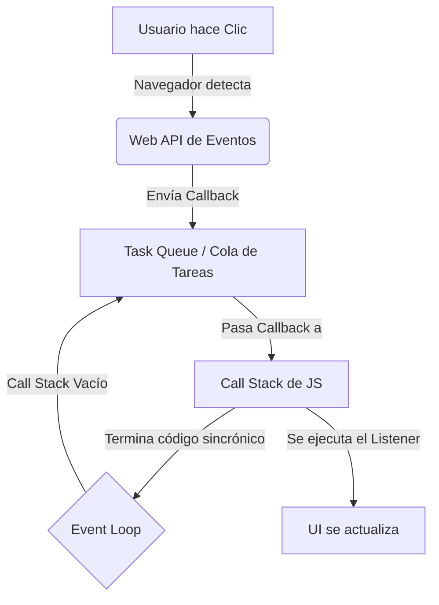

# 6. Eventos y Asincronía (Event Loop)

Los Listeners de eventos en el DOM son el ejemplo más puro y directo de **programación asíncrona** en JavaScript.

Para entender esto, debemos recordar cómo funciona JS debajo del capó:

1. **V8 Engine (Call Stack):** JavaScript es *Single-Threaded* (de un solo hilo). Solo puede hacer una cosa a la vez. Todo el código síncrono se apila y ejecuta en el "Call Stack".
2. **Web APIs:** Cuando hacemos `addEventListener('click', ...)` o `setTimeout(..., 1000)`, JavaScript le pasa esa responsabilidad al navegador (a las Web APIs escritas en C++).
3. **Task Queue (Cola de Tareas):** Cuando el usuario hace clic, el navegador "avisa", pero no interrumpe a JS de inmediato. Toma la función (callback) y la pone en una cola de espera.
4. **Event Loop:** Es un mecanismo que observa constantemente el Call Stack. Si el Call Stack está **completamente vacío** (no hay código síncrono ejecutándose), toma la primera función de la Cola de Tareas y la pone en el Call Stack para que se ejecute.

## Por qué esto es importante

Si el "Call Stack" está bloqueado ejecutando un código síncrono muy pesado (como un `for` loop que cuenta hasta 5,000,000,000), ¡los eventos no podrán ejecutarse! 
Aunque el usuario haga 10 clics en un botón, las funciones callback se irán acumulando en la Cola de Tareas, y la interfaz parecerá "congelada" hasta que el bucle `for` termine y el Call Stack se vacíe.

Es por esto que se dice que no debemos bloquear el hilo principal ("*Don't block the main thread*").
